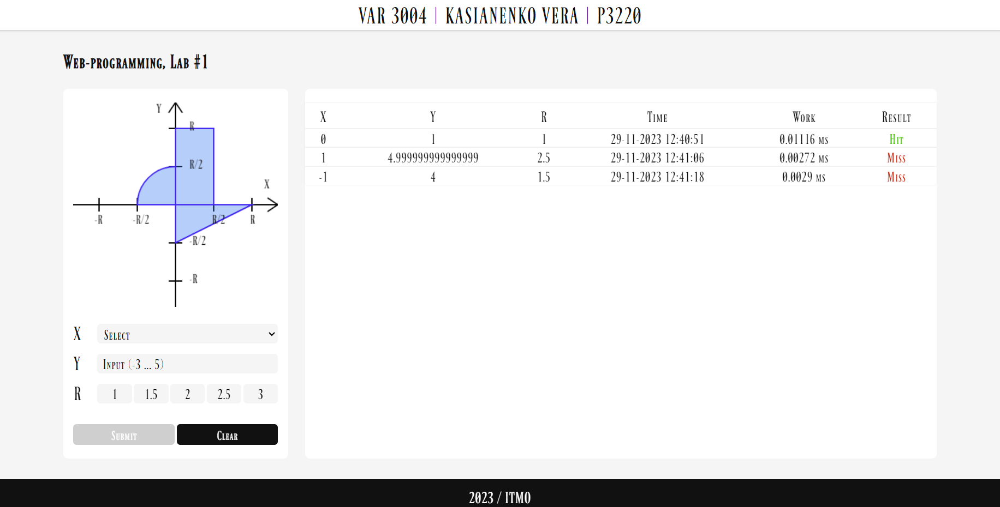
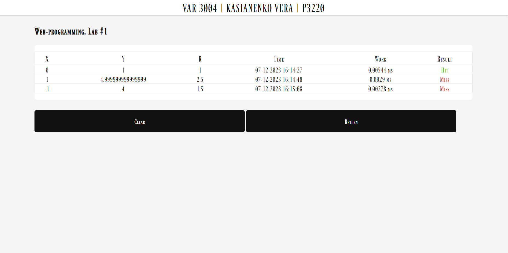
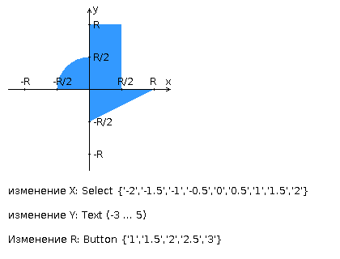
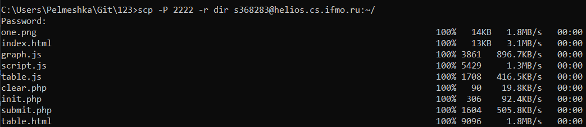
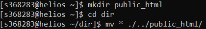
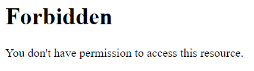
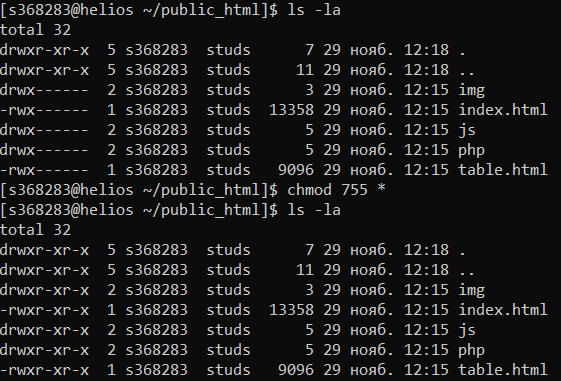

# Лабораторная работа #1
### Номер варианта: _3004_
[Ссылка на результат](https://se.ifmo.ru/~s368283/)

Интерфейс:

index.html



table.html



## Внимание! У разных вариантов разный текст задания!
Разработать PHP-скрипт, определяющий попадание точки на координатной плоскости в заданную область, и создать HTML-страницу, которая формирует данные для отправки их на обработку этому скрипту.

Параметр R и координаты точки должны передаваться скрипту посредством HTTP-запроса. Скрипт должен выполнять валидацию данных и возвращать HTML-страницу с таблицей, содержащей полученные параметры и результат вычислений - факт попадания или непопадания точки в область. Предыдущие результаты должны сохраняться между запросами и отображаться в таблице.

Кроме того, ответ должен содержать данные о текущем времени и времени работы скрипта.

__Разработанная HTML-страница должна удовлетворять следующим требованиям:__
- Для расположения текстовых и графических элементов необходимо использовать `блочную` верстку.
- Данные формы должны передаваться на обработку посредством `GET-запроса`.
- Таблицы стилей должны располагаться `в самом веб-документе`.
- При работе с CSS должно быть продемонстрировано использование `селекторов атрибутов, селекторов потомств, селекторов псевдоэлементов, селекторов классов`, а также такие свойства стилей CSS, как наследование и каскадирование.
- HTML-страница должна иметь "шапку", содержащую ФИО студента, номер группы и номер варианта. При оформлении шапки необходимо явным образом задать шрифт `(fantasy)`, его цвет и размер в каскадной таблице стилей.
- Отступы элементов ввода должны задаваться в `процентах`.
- Страница должна содержать сценарий на языке JavaScript, осуществляющий валидацию значений, вводимых пользователем в поля формы. Любые некорректные значения (например, буквы в координатах точки или отрицательный радиус) должны блокироваться.

__Изменения данных__
- изменение X: Select {'-2', '-1.5', '-1', '-0.5', '0', '0.5', '1', '1.5', '2'}
- изменение Y: Text (-3 … 5)
- Изменение R: Button {'1', '1.5', '2', '2.5', '3'}



__Вопросы к защите лабораторной работы:__
1. Протокол HTTP. Структура запросов и ответов, методы запросов, коды ответов сервера, заголовки запросов и ответов.
2. Язык разметки HTML. Особенности, основные теги и атрибуты тегов.
3. Структура HTML-страницы. Объектная модель документа (DOM).
4. HTML-формы. Задание метода HTTP-запроса. Правила размещения форм на страницах, виды полей ввода.
5. Каскадные таблицы стилей (CSS). Структура - правила, селекторы. Виды селекторов, особенности их применения. Приоритеты правил. Преимущества CSS перед непосредственным заданием стилей через атрибуты тегов.
6. LESS, Sass, SCSS. Ключевые особенности, сравнительные характеристики. Совместимость с браузерами, трансляция в "обычный" CSS.
7. Клиентские сценарии. Особенности, сферы применения. Язык JavaScript.
8. Версии ECMAScript, новые возможности ES6 и ES7.
9. Синхронная и асинхронная обработка HTTP-запросов. AJAX.
10. Библиотека jQuery. Назначение, основные API. Использование для реализации AJAX и работы с DOM.
11. Реализация AJAX с помощью SuperAgent.
12. Серверные сценарии. CGI - определение, назначение, ключевые особенности.
13. FastCGI - особенности технологии, преимущества и недостатки относительно CGI.
14. Язык PHP - синтаксис, типы данных, встраивание в веб-страницы, правила обработки HTTP-запросов. Особенности реализации принципов ООП в PHP.


# Локальный запуск
Вы можете посмотреть 2 и 4 пункты из [гайда](https://github.com/CandyGoose/OPD_web) (порты можно не менять, тогда лаба будет доступна на [http://localhost/](http://localhost/))

# Деплой 1 лабы на Helios
1) Необходимо закинуть все файлы на Helios (лучше кидать папку)

```
scp -P 2222 -r dir sXXXXXX@helios.cs.ifmo.ru:~/
```



В данном случае `dir` это папка со всеми файлами

2) Подключаемся к гелиосу и создаем папку `public_html` в корне

```
mkdir public_html
```

3) Перемещаем наши файлы в `public_html`

```
cd dir
mv * ./../public_html/
```



**Важно!** Чтобы лаба отображалась на сайте все файлы обязательно должны лежать в `public_html`

4) После этого вы можете перейти по адресу [https://se.ifmo.ru/~sXXXXXX/](https://se.ifmo.ru/~sXXXXXX/) и увидеть результат

*Примечания:* 
- Чтобы обновить файлы, лучше сначала удалить их прошлую версию с гелиоса, а потом добавить новую

Удалить файл:
```
rm file
```
Удалить папку:
```
rm -r dir
```
- Что делать, если вы видите ошибку `Forbidden`, но при этом все файлы в `public_html`



Попробуйте дать права и зайти на сайт снова: 

```
chmod 755 *
```


